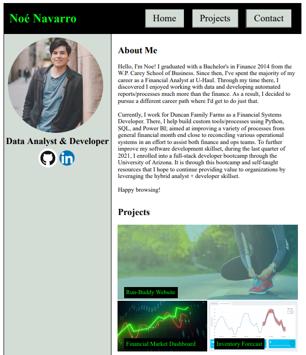

 

# Personal Website

## Description

This repository contains the code that produces my personal website. At least, the first iteration as of 11/2021. The main project presented is that of the **Run-Buddy** website. The task was to develop a responsive website using CSS that would adapt to various screen sizes. The others were previously created projects I will need to refactor for the best presentation. The second and third projects should be thought of as place holders for now :) 

My personal website uses `HTML` `CSS` in it's creation. 

## Preview

The page can be viewed [here](https://nnavarr.github.io/personal-website/)

